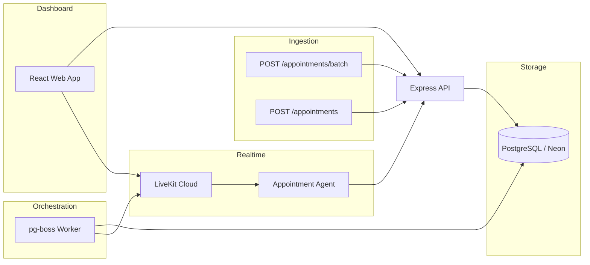

# Voice Repo

A pnpm monorepo for AI-powered voice agents that confirm clinic appointments over LiveKit. Patients join calls from the web dashboard; a LiveKit agent handles the conversation, updates appointment outcomes, and logs transcripts.

## Architecture



**Call flow**

1. Appointments are created via the API (`PENDING` status).
2. The worker polls for pending appointments and enqueues confirmation calls (up to `MAX_CONCURRENT_CALLS` at a time).
3. For each call, the worker creates a LiveKit room and dispatches the appointment-confirmation agent.
4. The agent waits for the patient to join before starting STT/TTS inference.
5. The patient joins from the web dashboard; the agent confirms, reschedules, or declines the appointment.
6. Outcomes and transcripts are persisted through the API.

## Monorepo layout

| Path | Package | Description |
|------|---------|-------------|
| `apps/api` | `@voice-repo/api` | Express REST API (appointments, calls, join tokens) |
| `apps/agent` | `@voice-repo/agent` | LiveKit voice agent for appointment confirmation |
| `apps/web` | `@voice-repo/web` | React dashboard to monitor calls and join sessions |
| `packages/worker` | `@voice-repo/worker` | pg-boss worker that schedules and starts calls |
| `packages/livekit` | `@voice-repo/livekit` | Shared LiveKit room/token helpers |
| `scripts/` | — | Demo seed and reset utilities |

## Prerequisites

- **Node.js** >= 20
- **pnpm** >= 10
- **PostgreSQL** database (Neon recommended)
- **LiveKit Cloud** project with API key/secret and inference credits

## Setup

1. **Clone and install dependencies**

   ```bash
   pnpm install
   ```

2. **Configure environment**

   Copy `.env.example` to `.env` and fill in your values:

   ```bash
   cp .env.example .env
   ```

   | Variable | Used by | Description |
   |----------|---------|-------------|
   | `DATABASE_URL` | API, worker | PostgreSQL connection string |
   | `SERVER_PORT` | API | API listen port (default `6080`) |
   | `LIVEKIT_URL` | API, worker, agent | LiveKit WebSocket URL |
   | `LIVEKIT_API_KEY` | API, worker, agent | LiveKit API key |
   | `LIVEKIT_API_SECRET` | API, worker, agent | LiveKit API secret |
   | `API_URL` | Agent | Base URL for agent → API callbacks |
   | `VITE_API_URL` | Web | API base path (`/api` in dev via Vite proxy) |
   | `WORKER_POLL_INTERVAL_MS` | Worker | How often to poll for pending appointments (default `30000`) |
   | `MAX_CONCURRENT_CALLS` | Worker | Max simultaneous active calls (default `3`) |

3. **Seed a demo appointment (optional)**

   ```bash
   node scripts/seed-demo.mjs
   ```

## Running locally

Start each service in its own terminal:

```bash
pnpm dev:api      # http://localhost:6080
pnpm dev:web      # http://localhost:5173
pnpm dev:agent    # LiveKit agent (appointment-confirmation-agent)
pnpm dev:worker   # pg-boss queues + call orchestration
```

On Windows PowerShell:

```powershell
Set-Location C:\voice-repo; pnpm dev:api
Set-Location C:\voice-repo; pnpm dev:web
Set-Location C:\voice-repo; pnpm dev:agent
Set-Location C:\voice-repo; pnpm dev:worker
```

Open the web app at [http://localhost:5173](http://localhost:5173) and select **Appointment Confirmation** to open the operations dashboard.

## API reference

Base URL: `http://localhost:6080`

### Health

| Method | Path | Description |
|--------|------|-------------|
| `GET` | `/health` | Health check |

### Appointments

| Method | Path | Description |
|--------|------|-------------|
| `GET` | `/appointments` | List all appointments |
| `GET` | `/appointments/:appointmentId` | Get one appointment |
| `POST` | `/appointments` | Create a single appointment |
| `POST` | `/appointments/batch` | Create up to 10 appointments per request |
| `PATCH` | `/appointments/:appointmentId/status` | Set terminal status (`CONFIRMED`, `DECLINED`, `RESCHEDULED`) |
| `POST` | `/appointments/:appointmentId/join` | Get a LiveKit token for the patient to join the call |
| `GET` | `/appointments/:appointmentId/call` | Get the latest call for an appointment |

**Single appointment body**

```json
{
  "appointmentId": "apt_001",
  "patientName": "Jane Doe",
  "phone": "+15551234567",
  "doctorName": "Dr. Smith",
  "appointmentDate": "2026-07-10",
  "appointmentTime": "14:00"
}
```

Required fields: `appointmentId`, `patientName`, `phone`, `appointmentDate`, `appointmentTime`.  
`doctorName` is optional and defaults to `"Dr. Smith"`.

**Batch create** — `POST /appointments/batch`

Accepts 1–10 appointments. Valid items are saved; invalid or duplicate items are skipped with per-item errors.

```json
{
  "appointments": [
    {
      "appointmentId": "apt_batch_001",
      "patientName": "Alice",
      "phone": "+15551234567",
      "appointmentDate": "2026-07-15",
      "appointmentTime": "10:00"
    }
  ]
}
```

| HTTP status | Meaning |
|-------------|---------|
| `201` | All items saved |
| `200` | Partial success (some saved, some failed) |
| `400` | Invalid request (bad array, empty batch, or more than 10 items) |

Example response (partial success):

```json
{
  "received": true,
  "count": 2,
  "saved": 1,
  "failed": 1,
  "results": [
    { "index": 0, "status": "saved", "appointment": { "..." : "..." } },
    { "index": 1, "status": "failed", "appointmentId": "apt_002", "errorMessage": "phone is required" }
  ]
}
```

### Calls

| Method | Path | Description |
|--------|------|-------------|
| `GET` | `/calls` | List all calls |
| `GET` | `/calls/stats` | Active/completed call statistics |
| `GET` | `/calls/:callId` | Get one call (includes transcript) |
| `PATCH` | `/calls/:callId` | Update call metadata |
| `POST` | `/calls/:callId/transcript` | Append a transcript segment |
| `POST` | `/calls/:callId/abandon` | Mark a call as abandoned |

## Worker

The worker uses [pg-boss](https://github.com/timgit/pg-boss) with two queues:

- **`fetch-appointments`** — polls for `PENDING` appointments without a room and enqueues call jobs
- **`start-confirmation-call`** — creates a LiveKit room, marks the appointment `CALLING`, and records the call

Concurrency is capped by `MAX_CONCURRENT_CALLS` (default 3). Additional pending appointments wait until active call slots free up.

### Utility scripts

```bash
# Reset all appointments to PENDING and purge pg-boss queues
pnpm --filter @voice-repo/worker exec node scripts/reset-stuck-calls.mjs

# Inspect appointment state in the database
pnpm --filter @voice-repo/worker exec node scripts/check-db-state.mjs

# Ping LiveKit connectivity
pnpm --filter @voice-repo/livekit exec node scripts/check-livekit.mjs

# Seed or reset the demo appointment
node scripts/seed-demo.mjs
node scripts/reset-demo.mjs
```

## Agent

The **Appointment Confirmation** agent (`apps/agent`) is a LiveKit Agents voice agent that:

- Reads appointment details from room/job metadata
- Waits for the patient to join before starting inference (avoids burning STT/TTS credits in empty rooms)
- Confirms, reschedules, or declines appointments via tool calls
- Posts status updates and transcripts back to the API

### Tests

```bash
pnpm test:agent              # Unit tests
pnpm --filter @voice-repo/agent test:integration   # Integration tests (requires running API)
```

## Web dashboard

The React app (`apps/web`) provides:

- A landing page to select voice agents
- An operations dashboard for the appointment-confirmation agent
- Live call monitoring, transcripts, and a patient join flow

In development, Vite proxies `/api` requests to the Express API on port 6080.

## Appointment statuses

| Status | Description |
|--------|-------------|
| `PENDING` | Awaiting worker pickup |
| `CALLING` | LiveKit room created, call in progress |
| `CONFIRMED` | Patient confirmed the appointment |
| `DECLINED` | Patient declined |
| `RESCHEDULED` | Patient rescheduled to a new date/time |

## Troubleshooting

- **Agent not responding** — Check LiveKit inference credits in the [LiveKit Cloud dashboard](https://cloud.livekit.io). HTTP 429 errors indicate rate limits or exhausted credits.
- **Appointments stuck in `CALLING`** — Run `reset-stuck-calls.mjs` to reset state and purge queues.
- **Too many concurrent calls** — Lower `MAX_CONCURRENT_CALLS` or wait for active calls to complete.
- **Web proxy errors on startup** — Start the API before the web app; proxy errors are transient while the API boots.

## License

Private — not for public distribution.